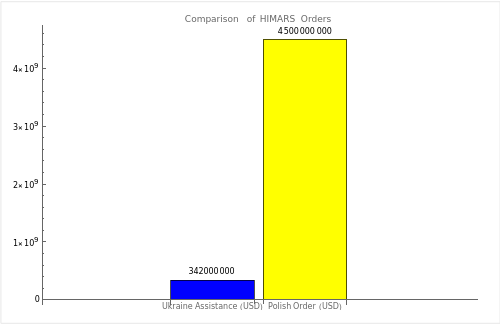
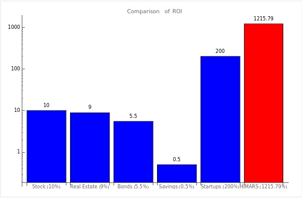

<aside>
🤖 **Made with Love and GPT**

</aside>

Hey folks, let's dive right into the buzz that's been circling around lately - the skyrocketing demand for High Mobility Artillery Rocket Systems, or HIMARS for short. Now, I've been digging into this, and it seems like the U.S. is playing Santa Claus, handing out these bad boys left and right, especially to Ukraine and Poland. But here's the kicker - not everyone is on board with this, with some even calling for a halt to the support. So, I decided to play devil's advocate (though in this case, Russia seems to be wearing the horns) and take a closer look at the economics of these deals.

First off, let's talk numbers. The U.S. has been pretty generous with Ukraine, assisting them with a cool 38 HIMARS systems. That's not just a military move, but a hefty economic one too. Meanwhile, Poland has gone on a shopping spree, ordering a whopping 500 units, making their deal a whole lot bigger in both scale and value. Just to give you a clearer picture, check out this chart on the right, that compares the financial aspects of these transactions.

Comparison between the US’s HIMARS deals (in USD) with Poland and Ukraine showing a difference of about +1215.79% for the polish order.

---

Now, I couldn't just stop there. I got curious about how this whole thing stacks up as an investment. And let me tell you, the ROI from these HIMARS deals is nothing short of jaw-dropping, especially when you stack it up against traditional investment opportunities like the stock market or real estate. Don't believe me? Take a peek at this next chart where I've compared the ROI from the HIMARS deals with other common investment avenues. These numbers are so ridiculous, I needed to use a logarithmic scale for the y-axis.

Quick detour: ROI, or Return on Investment, usually measures the financial gains from investments, calculated as:

$$
ROI = \left( \frac{{\text{{Net Profit}}}}{{\text{{Cost of Investment}}}} \right) \times 100\%

$$

Here we are jazzing it up, using it to gauge the "advertisement value" (I guess you could call it “ROA”) the U.S. snagged from the HIMARS deal with Ukraine, which kind of looks like this:

$$
\text{{Creative ROI}} = \left( \frac{{\text{{Advertisement Value}}}}{{\text{{Cost of Investment}}}} \right) \times 100\%

$$

Comparing the “Return On Investment” (ROI) between common investment-opportunities and the polish HIMARS deal. (logarithmic y-axis)

A bit unconventional, but oh so revealing, don't you think?

---

Alright, time to get serious. While the bucks rolling in from these deals are hard to ignore, it's also sparked a pretty heated debate on the ethics of war economics. Ukraine's President, Volodymyr Zelenskyy, recently criticized the UN for its inability to defend sovereign borders, calling for a re-evaluation of Russia's veto power in the organization. This stance reflects a growing discontent with the existing global structures and hints at the formation of new alliances, a development that cannot be ignored.

Furthermore, we cannot overlook the aggressive stances adopted by other nations, notably China. The country has laid bare its unjustified territorial ambitions, claiming parts of Vietnam, Malaysia, the Philippines, and even Russia. This, coupled with their tightening grip on Hong Kong and the looming threats towards Taiwan, paints a picture of a world where territorial disputes are becoming increasingly commonplace.

Now, I'm not one to champion the war economy, but looking at Russia trying to mimic Germany's aggressive expansion in 1939, I can't help but think that maybe, just maybe, there's no other option on the table. It's a grim picture, but one that cannot be ignored in the pursuit of a safer, more stable world. I believe Zelenskyy himself put it best at the UN summit, when he said:

> "We must act united – to defeat the aggressor and focus all our capabilities and energy on addressing these challenges. As nukes are restrained, likewise the aggressor must be restrained and all its tools and methods of war.”
> **- Volodymyr Zelenskyy at the UN (talking about climate change)**

But hey, it's not all doom and gloom. Each one of us has a role to play in shaping a brighter future. By staying informed and engaging in constructive discussions, we can foster understanding and work towards a world where conflicts are resolved through dialogue, not warfare.

So, let's keep the conversation going, shall we?

---

This article was made during a silly little bit of news-research with ChatGPT. If you want to see how it was made, here’s the link to the chat. Keep in mind, that hosted images, like the diagrams from this article, may not show up for you in the chat. The files have to be hosted somewhere and that stuff’s expensive…

[ChatGPT](https://chat.openai.com/share/41001ea5-4576-4170-b18e-73446c637a6d)

If you find it helpful in any way, I would love to hear about it. <3
